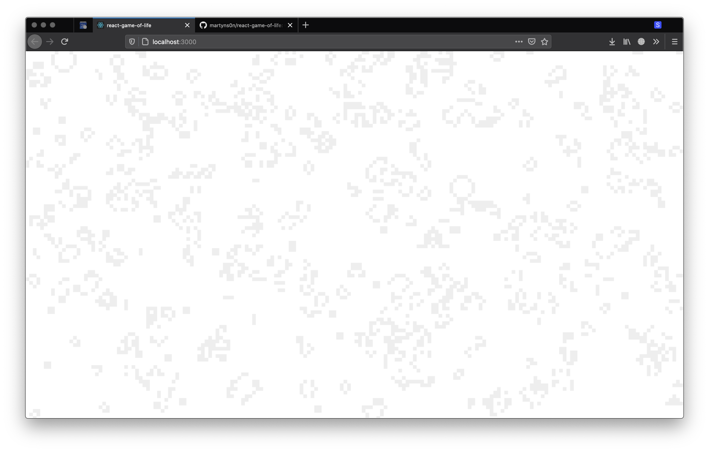

# react-game-of-life-background

> React component for game of life visualisation

[](https://www.npmjs.com/package/react-game-of-life-background) [](https://standardjs.com)

## Install

```bash
npm install --save react-game-of-life-background
```

## Usage

```jsx
import React, { Component } from 'react'

import GameOfLifeBackground from 'react-game-of-life-background'

class Example extends Component {
  render() {
    return <GameOfLifeBackground delay={1000} color='#EEE' />
  }
}
```

## Demo



Look at ➡ https://someta.site/react-game-of-life-background/

## License

MIT © [martyns0n](https://github.com/martyns0n)
